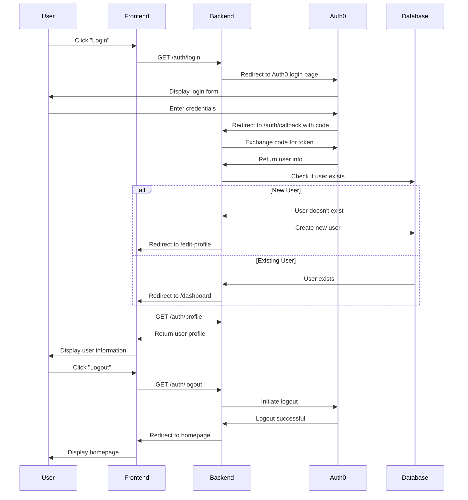

# ProjectZer0

ProjectZer0 is an ambitious, open-source web application designed to revolutionize how communities share knowledge, make decisions, and visualize complex information. By leveraging modern web technologies and graph database capabilities, it offers a flexible and scalable platform for users to engage in discussions, vote on ideas, and interact with data in novel ways.

## Project Structure

### Frontend (ProjectZer0Frontend)
- Framework: SvelteKit
- Language: TypeScript
- Authentication: Auth0
- Data Visualization: D3.js, Three.js (planned)

### Backend (ProjectZer0Backend)
- Framework: NestJS
- Language: TypeScript (Node.js)
- Database: Neo4j
- Authentication: Auth0

### AI Component (ProjectZer0AI)
- Framework: FastAPI
- Language: Python
- Libraries: Hugging Face, KeyBERT

## Key Features

- Secure User Authentication: Integrated Auth0 for robust, scalable user authentication and management.
- Discussion Threads: Allows users to create and participate in threaded discussions on various topics.
- Voting System: Implements a sophisticated voting mechanism for ideas, comments, and other user-generated content.
- User Profiles: Manages detailed user profiles including activity history and preferences.
- Core Game Logic: Implements gamification elements to encourage user engagement and contribution.
- Data Visualization: (Planned) Will feature interactive data visualizations using D3.js and Three.js to represent complex information and user interactions.
- API-First Design: Built with a microservices architecture, allowing for flexible integration and scalability.

## Current Progress

### Frontend
- Auth0 Integration: Successfully integrated Auth0 for user authentication.
- Routing Logic: Implemented routing to direct users to their dashboard or edit-profile page based on their profile status.
- Testing: Set up unit tests with Vitest.

### Backend
- Database Connection: Successfully connected to Neo4j database.
- API Setup: Established basic NestJS application structure.
- User Verification Endpoint: Prepared to handle requests to verify user existence.

## Next Steps

1. Connect Frontend and Backend:
   - Implement API calls from the frontend to the backend to verify user existence.
   - Ensure the backend properly validates Auth0 tokens and retrieves user information.
2. Profile Management:
   - Develop features for users to create and edit their profiles.
3. Error Handling & Notifications:
   - Implement user feedback for authentication errors or profile issues.
4. Data Visualization:
   - Integrate D3.js and Three.js for interactive data representations.
5. AI Integration:
   - Develop the FastAPI-based AI component for advanced analytics and recommendations.

## How to Run the Project

### Frontend

1. Install Dependencies:
   ```bash
   cd ProjectZer0Frontend
   npm install
   ```

2. Run Development Server:
   ```bash
   npm run dev
   ```

3. Run Tests:
   ```bash
   npm run test:unit
   ```

### Backend

1. Install Dependencies:
   ```bash
   cd ProjectZer0Backend
   npm install
   ```

2. Start the Server:
   ```bash
   npm run start:dev
   ```

## Authentication Flow



## Testing and Development

- Unit Testing: Currently set up on the frontend using Vitest.
- Environment Variables: Ensure you have a `.env` file set up with the necessary configuration (excluding sensitive information).

## Future Plans

- Implement real-time updates using WebSockets for live discussion and voting features.
- Integrate advanced analytics and machine learning to provide personalized user experiences and content recommendations.
- Expand the platform's API to allow third-party integrations and extensions.
- Implement a comprehensive testing strategy including unit, integration, and end-to-end tests.
- Deploy the application using container orchestration for improved scalability and resource management.

## Contributing

We welcome contributions to ProjectZer0! Please read our [Contributing Guidelines](CONTRIBUTING.md) for details on how to submit pull requests, report issues, or request features.

## License

This project is licensed under the [MIT License](LICENSE).